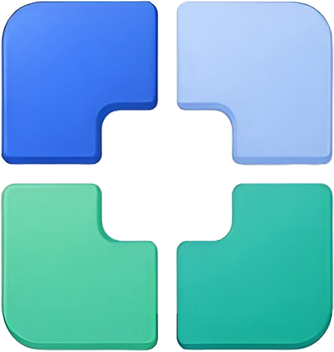

<div align="center">
  
  
  # Endpoint Forge
  
  **A standalone Electron + Vite desktop application with a toggleable secure network server.**
</div>

---


---
## 📖 Overview

**Endpoint Forge** is a modern desktop utility application designed for IT administration and local network sharing. Built on the Electron framework with a React/Vite frontend, it allows you to run local utility applications—such as Android Enterprise Intune QR Generators—and broadcast them securely to other devices on your local network.


## ✨ Key Features

- **Toggleable Network Server**: Spin up a local Express web server at the click of a button to serve the Endpoint Forge UI to other devices (phones, tablets, laptops) on your local Wi-Fi.
- **Strict Security Boundaries**: The Settings dashboard—which controls the server lifecycle and application updates—is locked securely behind the Electron desktop environment. Network users receive the UI but are physically isolated from administrative controls.
- **Intune QR Generator**: Upload Android Enterprise JSON files, manually override enrollment tokens, inject custom `android.app.extra` flags, and export compliant QR codes directly from the dashboard.
- **Dark Mode Persistence**: Native dark mode that remembers your preference individually across desktop and network clients.
- **Modern Stack**: Built with React 19, Tailwind CSS v4, Lucide Icons, and Vite.

## 🚀 Getting Started

### Prerequisites

Ensure you have [Node.js](https://nodejs.org/) installed on your machine.

### Installation

1. Clone the repository and navigate to the project folder.
2. Install dependencies:
   ```bash
   npm install
   ```

### Development (Web UI)

To start the Vite development server (for UI work):
```bash
npm run dev
```

### Running the Desktop App

To compile the Electron scripts and launch the desktop application locally:
```bash
npm run electron:start
```

### Packaging for Release

To compile the application into a standalone Windows installer (`.exe`) using `electron-builder`:
```bash
npx electron-builder --win
```
*Compiled installers will be placed in the `release/` directory.*

## 🏗️ Architecture

The app bridges a modern SPA and a Node.js desktop environment:
- **`electron/main.ts`**: The Electron main process. Manages window lifecycles, IPC bridging, the system tray, and the internal Express web server.
- **`electron/preload.ts`**: The secure context bridge. Exposes specific, safe functions (like `startServer` and `getServerStatus`) to the React frontend.
- **`src/`**: The React renderer process. Displays the UI and communicates with the main process via the `window.electronAPI`.
